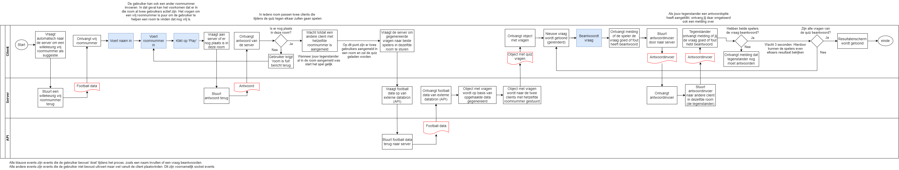

# Real time web
Dit project bevat een football quiz app waarbij twee spelers het real-time tegen elkaar op kunnen nemen door zoveel mogelijk vragen over voetbal goed te beantwoorden. Hierbij is gebruikgemaakt van HTML, CSS, JavaScript, Node.js en Socket.io. Ook is er gebruikgemaakt van een externe API om football data op te halen waaruit de quizvragen worden gegenereerd.

## De drie concepten
Om alvast wat inspiratie te krijgen, heb ik onderzoek gedaan naar de verschillende beschikbare API's. Op basis daarvan heb ik drie verschillende ideeën globaal geschetst en beschreven.

### Concept 1: Football quiz app
Het eerste idee is een quiz app met vragen over voetbal. Het idee is dat twee spelers het tegen elkaar opnemen om te zien wie de meeste kennis over voetbal heeft. Hierbij kunnen verschillende vragen gesteld worden als "Welke speler komt uit (een land)?", "Hoeveel doelpunten heeft (speler X) dit seizoen gemaakt?".

### Concept 2: Rijksmuseum quiz app
Het tweede idee lijkt sterk op het idee van de voetbalquiz. Het verschil is dat hier bij iedere vraag een schilderij wordt getoond en dat de spelers moeten raden welke schilder hierbij hoort.

### Concept 3: Weather app
Het derde idee is een weer app waarbij de gebruiker realtime data ontvangt van de huidige weersomstandigheden in een zelfgekozen stad.

## Het gekozen concept
Het concept dat ik ga uitwerken is de voetbal quiz app. Nog voordat ik ben begonnen met ontwikkelen, heb ik eerst mijn ideeën wat verder uitgewerkt. Ik heb eerst een aantal schermen geschetst om te laten zien hoe de app er uiteindelijk uit moet zien. Hieronder leg ik de schermen uit:

### De schermen
Omdat je in mijn potentiële app met z'n tweeën tegen elkaar speelt, heb ik bedacht dat je in socket.io rooms kan maken door de ene speler een gegenereerde code (het room id) aan de andere speler te laten geven, zodat deze twee spelers in dezelfde room zitten.

Het spel zelf heeft als idee dat je een aantal vragen krijgt die op basis van de data uit de API worden gegenereerd. Een speler krijgt bij het beantwoorden van een vraag meteen te zien of hij/zij de vraag goed of fout heeft beantword. Wanneer beide spelers de vraag hebben beantwoord (ongeacht goed of fout), gaat de app door naar de volgende vraag. Als alle vragen voorbij zijn, gaat de app over naar een resultatenscherm waarin te zien is wie de meeste vragen goed heeft beantwoord.

### Het data lifecycle diagram
Hieronder heb ik geprobeerd om de datastroom tussen de clients, de server en de API te visualiseren.
Bij de quiz app is het zoals gezegd de bedoeling dat twee spelers tegen elkaar spelen in dezelfde room. Deze twee spelers geven elkaar een gegenereerde room code door, voordat het spel daadwerkelijk begint. Zie het diagram hieronder:

### De API

### Het datamodel
Hieronder heb ik geprobeerd om schematisch weer te geven welke data er in de app gebruikt wordt en hoe deze data zich tot elkaar verhoudt. Dit betreft zowel API-data als data die gebruikt wordt om namen en scores op te slaan. Zie het datamodel hieronder:
DATAMODEL

### Eventuele toekomstplannen
Wanneer ik besluit om dit project in de toekomst te verbeteren of uit te breiden, zal ik onderstaande acties ondernemen:

- Ik zal proberen om bij het opvragen van de football data meerdere API-calls te doen. Hierdoor kan ik meer soorten vragen maken. Op dit moment heb ik namelijk alleen vragen over namen van voetbalstadions. Als ik meer verschillende soorten vragen kan toevoegen, dacht ik aan vragen als "Welke speler komt uit (een land)?", "Hoeveel doelpunten heeft (speler X) dit seizoen gemaakt?".

- Ik zal proberen om, puur voor de netheid en onderhoudbaarheid, wat meer real-time data op de server op te slaan. Hierbij dacht ik aan het bijhouden van namen en scores van spelers die op dat moment bezig zijn.

## Bronnen
- https://www.football-data.org/documentation/quickstart
- https://docs.google.com/spreadsheets/d/1YKMTvdWVbzJ-CXDCHBEH2n3KofcQTN7EerTOEXy9MHI/edit#gid=0
- https://app.diagrams.net/
- https://www.subpng.com/png-tzm7b4/
- https://browsecat.net/other/champions-league-wallpapers
- https://socket.io/
- https://www.web-technology-experts-notes.in/2018/05/ioemit-vs-socketemit-vs-socket-broadcast-emit.html