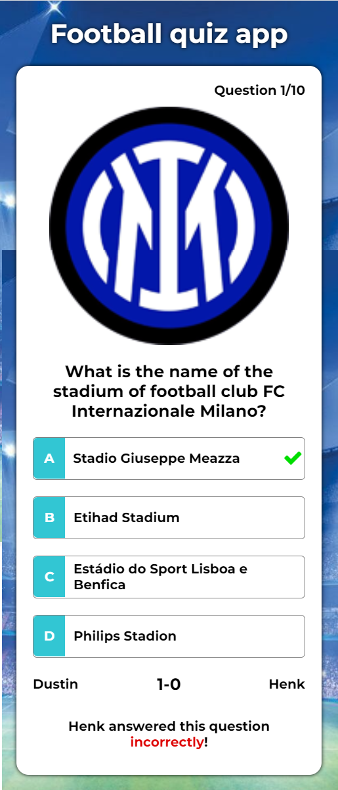

# Real time web
Dit project bevat een football quiz app waarbij twee spelers het real-time tegen elkaar op kunnen nemen door zoveel mogelijk vragen over voetbal goed te beantwoorden. Hierbij is gebruikgemaakt van HTML, CSS, JavaScript, Express, Node.js en Socket.io. Ook is er gebruikgemaakt van een externe API om football data op te halen waaruit de quizvragen worden gegenereerd.

## Table of Contents
  * [De drie concepten (vooraf)](#de-drie-concepten-(vooraf))
    + [Concept 1: Football quiz app (vooraf)](#concept-1--football-quiz-app-(vooraf))
    + [Concept 2: Rijksmuseum quiz app (vooraf)](#concept-2--rijksmuseum-quiz-app-(vooraf))
    + [Concept 3: Weather app (vooraf)](#concept-3--weather-app-(vooraf))
  * [Het gekozen concept (vooraf)](#het-gekozen-concept-(vooraf))
  * [De schermen (vooraf)](#de-schermen-(vooraf))
  * [Het data lifecycle diagram](#het-data-lifecycle-diagram)
  * [De API](#de-api)
  * [Het datamodel en de dataopslag](#het-datamodel-en-de-dataopslag)
  * [Het eindresultaat](#het-eindresultaat)
    + [Het aanmeldscherm](#het-aanmeldscherm)
    + [Het vragenscherm](#het-vragenscherm)
    + [Het resultatenscherm](#het-resultatenscherm)
    + [Het disconnectedscherm](#het-disconnectedscherm)
  * [Eventuele toekomstplannen](#eventuele-toekomstplannen)
  * [Bronnen](#bronnen)

## De drie concepten (vooraf)
Om alvast wat inspiratie te krijgen, heb ik onderzoek gedaan naar de verschillende beschikbare API's. Op basis daarvan heb ik drie verschillende ideeën globaal geschetst en beschreven.

### Concept 1: Football quiz app (vooraf)
Het eerste idee is een quiz app met vragen over voetbal. Het idee is dat twee spelers het tegen elkaar opnemen om te zien wie de meeste kennis over voetbal heeft. Hierbij kunnen verschillende vragen over voetbal gesteld worden.

### Concept 2: Rijksmuseum quiz app (vooraf)
Het tweede idee lijkt sterk op het idee van de voetbalquiz. Het verschil is dat hier bij iedere vraag een schilderij wordt getoond en dat de spelers moeten raden welke schilder hierbij hoort.

### Concept 3: Weather app (vooraf)
Het derde idee is een weer app waarbij de gebruiker realtime data ontvangt van de huidige weersomstandigheden in een zelfgekozen stad.

## Het gekozen concept (vooraf)
Het concept dat ik ga uitwerken is de voetbal quiz app. Nog voordat ik ben begonnen met ontwikkelen, heb ik eerst mijn ideeën wat verder uitgewerkt. Ik heb eerst een aantal schermen geschetst om te laten zien hoe de app er uiteindelijk uit moet zien. Hieronder leg ik de schermen uit:

## De schermen (vooraf)
Omdat je in mijn potentiële app met z'n tweeën tegen elkaar speelt, heb ik bedacht dat je in socket.io rooms kan maken door de ene speler een gegenereerde code (het room id) aan de andere speler te laten geven, zodat deze twee spelers in dezelfde room zitten.

Het spel zelf heeft als idee dat je een aantal vragen krijgt die op basis van de data uit de API worden gegenereerd. Een speler krijgt bij het beantwoorden van een vraag meteen te zien of hij/zij de vraag goed of fout heeft beantword. Wanneer beide spelers de vraag hebben beantwoord (ongeacht goed of fout), gaat de app door naar de volgende vraag. Als alle vragen voorbij zijn, gaat de app over naar een resultatenscherm waarin te zien is wie de meeste vragen goed heeft beantwoord.

## Het data lifecycle diagram
Hieronder heb ik geprobeerd om de datastroom tussen de clients, de server en de API te visualiseren.
Zie het diagram hieronder:

Zoals in het diagram te zien is, draait er een minitabel (een dictionary object in JavaScript) op de server. De scores van de spelers tijdens de game worden op de clients opgeslagen als variabelen "your_score" en "opponent_score". De reden waarom ik wel de namen en roomnummers op de server wil laten opslaan, is dat er hiermee gecheckt kan worden of een betreffende room nog vrij is of niet. Wanneer een game begint, kan bovendien meteen de naam van de andere client in dezelfde room (oftewel de tegenstander) worden doorgegeven.

## De API
Wanneer twee clients in dezelfde room zich aangemeld hebben, wordt er een API-call gedaan. De API die ik gebruik is afkomstig van football-data.org. De API-call die ik maak, gaat naar de URL: https://api.football-data.org/v2/competitions/CL/teams. Dit geeft mij alle teams die in het afgelopen voetbalseizoen in de Champions League actief zijn geweest. Hierbij wordt ook per team de naam van het voetbalstadion en een URL naar het clublogo meegeleverd. Deze gegevens heb ik gefilterd en hiermee heb ik de vragen gegenereerd.
Wanneer twee nieuwe clients in dezelfde room zich aangemeld hebben, krijgen zij dus niet dezelfde quizvragen te zien als de andere twee clients.

## Het datamodel en de dataopslag
Hieronder heb ik schematisch weergegeven welke data er in de app gebruikt wordt en hoe deze data zich tot elkaar verhoudt. Zie het datamodel hieronder:

## Het eindresultaat
Het eindresultaat is een single page web app met verschillende schermen. Alle schermen zijn aparte sections die met JavaScript getoond of weggehaald worden. Wanneer er meerdere pagina's zouden zijn, dan zouden de socket-verbindingen wegvallen op het moment dat je naar een andere pagina navigeert.

### Het aanmeldscherm
Dit is het eerste scherm dat een gebruiker te zien krijgt. Hier kunnen de spelers hun naam invoeren en een gedeelde roomnummer invoeren. De server geeft alvast een suggestie welk roomnummer nog vrij is.

### Het vragenscherm
Wanneer beide spelers aangemeld zijn met hetzelfde roomnummer, wordt dit scherm getoond waarin alle vragen worden gespeeld. De quiz bevat 10 vragen.

### Het resultatenscherm
Wanneer alle vragen gespeeld zijn, wordt dit resultatenscherm getoond.

### Het disconnectedscherm
Wanneer één van de spelers tijdens het spelen de verbinding verbreekt, krijgt de andere speler in dezelfde room dit scherm te zien.

## Eventuele toekomstplannen
Wanneer ik besluit om dit project in de toekomst te verbeteren of uit te breiden, zal ik onderstaande acties ondernemen:
- Ik zal proberen om bij het opvragen van de football data meerdere API-calls te doen. Hierdoor kan ik meer soorten vragen maken. Op dit moment heb ik namelijk alleen vragen over namen van voetbalstadions. Als ik meer verschillende soorten vragen kan toevoegen, dacht ik aan vragen als "Welke speler komt uit (een land)?", "Hoeveel doelpunten heeft (speler X) dit seizoen gemaakt?".
- Ik zal proberen om, puur voor de netheid en onderhoudbaarheid, wat meer real-time data op de server op te slaan. Hierbij dacht ik aan het bijhouden van namen en scores van spelers die op dat moment bezig zijn.

## Bronnen
- https://www.football-data.org/documentation/quickstart
- https://docs.google.com/spreadsheets/d/1YKMTvdWVbzJ-CXDCHBEH2n3KofcQTN7EerTOEXy9MHI/edit#gid=0
- https://app.diagrams.net/
- https://www.subpng.com/png-tzm7b4/
- https://browsecat.net/other/champions-league-wallpapers
- https://socket.io/
- https://www.web-technology-experts-notes.in/2018/05/ioemit-vs-socketemit-vs-socket-broadcast-emit.html